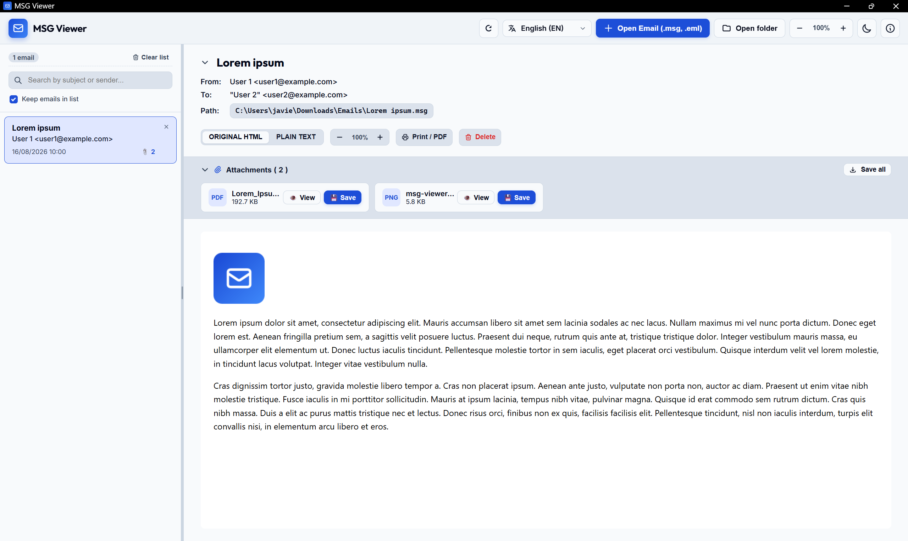
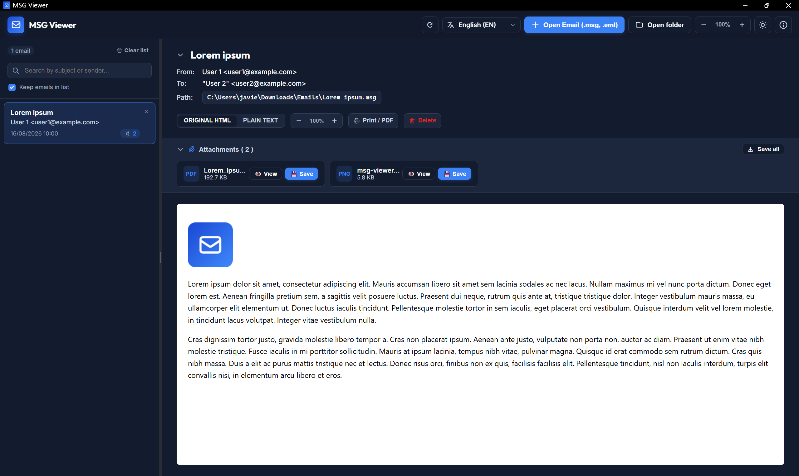

# MSG Viewer

[](LICENSE)
[](https://www.microsoft.com)
[](#-features)

**MSG Viewer** is a lightweight, secure, and fully offline `.msg` and `.eml` email file viewer designed for Windows. It allows users to open, inspect, and extract attachments from Microsoft Outlook message files (`.msg`) and standard RFC 822 / MIME email files (`.eml`) without requiring Microsoft Outlook, administrative permissions, or uploading sensitive data to external servers.





---

## 📑 Table of Contents

- [MSG Viewer](#msg-viewer)
  - [📑 Table of Contents](#-table-of-contents)
  - [✨ Features](#-features)
  - [🛠️ Architecture Overview](#️-architecture-overview)
  - [📡 Port \& Data Exchange (Frontend ⟷ Backend)](#-port--data-exchange-frontend--backend)
    - [Dedicated Network Port: `48721`](#dedicated-network-port-48721)
    - [Information Exchange Flow](#information-exchange-flow)
  - [🚀 Getting Started](#-getting-started)
    - [Prerequisites](#prerequisites)
    - [Quick Launch](#quick-launch)
  - [🔗 Windows Integration (Desktop Shortcut)](#-windows-integration-desktop-shortcut)
    - [Option 1: Directly from the Application UI (Recommended)](#option-1-directly-from-the-application-ui-recommended)
    - [Option 2: Using PowerShell Script](#option-2-using-powershell-script)
  - [📂 Project Structure](#-project-structure)
  - [📦 Building Standalone Executable (.exe)](#-building-standalone-executable-exe)
  - [🔒 Security \& Privacy](#-security--privacy)
  - [📄 License](#-license)

---

## ✨ Features

- **🔒 100% Offline & Private**: All file processing occurs locally on your machine. Your emails and attachments never leave your device.
- **📧 Multi-Format Support (.msg & .eml)**: Full compatibility with Outlook binary message files (`.msg`) and standard MIME/RFC 822 files (`.eml`).
- **📧 Complete Email Rendering**: High-fidelity display of HTML bodies, plain text fallbacks, sender/recipient metadata, headers, and dates.
- **📎 Attachment Management**: Detects, previews, and allows direct one-click downloads of all attached files.
- **🎨 Modern Web UI**: Responsive email client layout featuring:
  - **Dark Mode / Light Mode** (automatic system detection & persistent preference).
  - **Multi-language Support** (English, Spanish, French, and Portuguese with live switching).
  - **Drag & Drop** file opening support for `.msg` and `.eml` files.
- **💻 Zero-Admin Windows Integration**:
  - **1-Click Desktop Shortcut**: Create a desktop icon directly from the UI or PowerShell.
  - Run standalone in native Edge App Mode (`--app`).
  - Silent launcher script to hide terminal windows.

---

## 🛠️ Architecture Overview

MSG Viewer operates as a dual-layer application:

1. **Frontend**: Standalone web interface built with HTML5, CSS3, and JavaScript, running inside Microsoft Edge in App Mode (`--app`) or standard modern browsers.
2. **Backend**: Lightweight local Python HTTP/REST API server listening on `127.0.0.1:48721`, using `extract-msg` and Python's native `email` standard library to parse `.msg` and `.eml` formats directly from the file system or memory.

```text
[ .msg / .eml File ] ──► [ Local Python Server (127.0.0.1:48721) ] ──► [ MSG Viewer App (Edge/Browser UI) ]
```

---

## 📡 Port & Data Exchange (Frontend ⟷ Backend)

### Dedicated Network Port: `48721`

The local server binds strictly to loopback address **`127.0.0.1:48721`**.

- **Conflict Prevention**: Standard ports like `8080`, `8000`, `3000`, or `5000` are frequently occupied by web servers (Tomcat, Spring Boot, IIS), developer tools, or Docker containers. Port `48721` resides in the unassigned private range, preventing port collision issues.
- **Local Isolation**: The socket is bound exclusively to `127.0.0.1` (localhost), meaning it is completely unreachable from outside the machine or local area network.

### Information Exchange Flow

The application features a **Dual-Engine** communication model:

```text
┌────────────────────────────────────────────────────────────────────────┐
│                        MSG Viewer Frontend (UI)                        │
│                (Edge App / JavaScript / DOM Sanitizer)                 │
└───────────────────▲────────────────────────────────▲───────────────────┘
                    │                                │
       HTTP Fetch   │ (JSON Response)                │ (Pure JS Fallback)
       REST API     │ Metadata, HTML, Attachments    │ If Python offline
                    │                                │
┌───────────────────▼────────────────────────────────▼───────────────────┐
│                     Local Python Server (48721)                        │
│              (extract-msg & email / PowerShell Dialogs)                │
└────────────────────────────────────────────────────────────────────────┘
```

1. **Server-Assisted Processing (Primary)**:
   The frontend communicates asynchronously with the local Python server via the standard `Fetch API`.
   - **`GET /api/health`**: Health-check endpoint used during startup to verify server readiness or detect existing instances before opening new windows.
   - **`GET /api/load-file?path=<path>`**: Loads and extracts a `.msg` or `.eml` file directly from local disk. Python extracts headers, sender/recipient details, date/time, HTML/plain text bodies, and base64-encoded attachments, returning a structured JSON payload to the UI.
   - **`POST /api/parse`**: Parses raw `.msg` or `.eml` binary buffers uploaded via drag-and-drop or file selection.
   - **`GET/POST /api/pick-files` & `/api/pick-folder`**: Triggers native Windows file/folder selection dialogs through PowerShell, recursively scanning directories for `.msg` and `.eml` files and extracting metadata in batches.
   - **`POST /api/open-folder`**: Opens Windows File Explorer highlighting the active email file location on disk.
   - **`POST /api/delete-file`**: Safely removes the selected email file from disk upon user confirmation.
   - **`POST /api/create-shortcut`**: Automatically generates a Windows Desktop shortcut with the custom application icon.

2. **Client-Side Fallback (Secondary)**:
   If the Python server is not reachable, the frontend seamlessly activates its embedded JavaScript OLE Compound File (CFBF), EML MIME parser, and LZFu decompressor engine, enabling 100% standalone offline operation directly within any browser window.

---

## 🚀 Getting Started

### Prerequisites

- **Windows 10 / 11**
- **Python 3.8+** (recommended for full binary parsing)
- **Dependencies**:

  ```bash
  pip install extract-msg
  ```

### Quick Launch

```bash
git clone https://github.com/YOUR_USERNAME/msg-viewer.git
cd msg-viewer
```

1. Start the viewer:
   - **Silent Mode (Recommended)**: Double-click `MSG-Viewer.vbs` to launch the application seamlessly without opening a console window.
   - **Command Prompt**: Run `Start-MSG-Viewer.cmd`.

---

## 🔗 Windows Integration (Desktop Shortcut)

You can create a desktop shortcut in two ways:

### Option 1: Directly from the Application UI (Recommended)

1. Open the application.
2. Click the **About** icon (`ℹ️`) in the top navigation bar or the **Windows Integration** button on the welcome screen.
3. Under the **Windows Integration** section, click **Create Desktop Shortcut**.

### Option 2: Using PowerShell Script

```powershell
Set-ExecutionPolicy -Scope Process -ExecutionPolicy Bypass
.\scripts\Create-Desktop-Shortcut.ps1
```

---

## 📂 Project Structure

```text
msg-viewer/
├── index.html                    # Main application user interface
├── manifest.json                 # Web app manifest configuration
├── favicon.ico                   # Multi-resolution application icon
├── Start-MSG-Viewer.cmd          # Windows batch launcher (starts server & opens app mode)
├── MSG-Viewer.vbs                # Silent VBScript launcher (hides command prompt)
├── css/                          # CSS stylesheets (design system, dark/light themes)
├── docs/                         # Documentation assets and icons (SVG, PNG, ICO)
├── js/                           # Client-side logic (UI, parsing fallback, i18n)
├── py/                           # Local Python server & backend scripts
│   ├── server.py                 # HTTP REST API server (processes .msg & .eml files)
│   └── launch.ps1                # Background python server launcher
└── scripts/                      # Utility scripts
    ├── Build-EXE.ps1             # Build standalone MSG-Viewer.exe using PyInstaller
    ├── Create-Desktop-Shortcut.ps1 # Create Windows desktop shortcut with app icon
    └── Sign-Application.ps1      # Self-signing code certificate script
```

---

## 📦 Building Standalone Executable (.exe)

To compile a standalone portable executable `dist/MSG-Viewer.exe` with the custom application icon embedded:

```powershell
Set-ExecutionPolicy -Scope Process -ExecutionPolicy Bypass
.\scripts\Build-EXE.ps1
```

Or using PyInstaller directly:

```powershell
pyinstaller MSG-Viewer.spec --clean --noconfirm
```

The resulting executable will be located in `dist/MSG-Viewer.exe`.

---

## 🔒 Security & Privacy

- **No Remote Calls**: No telemetry, tracking scripts, or external dependencies.
- **Localhost Binding**: The local backend server binds strictly to `127.0.0.1:48721` and is inaccessible from external networks.
- **No Installation Needed**: Works cleanly out of local directories without installing system-wide drivers or background services.

---

## 📄 License

Distributed under the GNU General Public License v3.0 (GPLv3). See [`LICENSE`](https://github.com/javierorp/MSG-Viewer?tab=GPL-3.0-1-ov-file) for more information.
